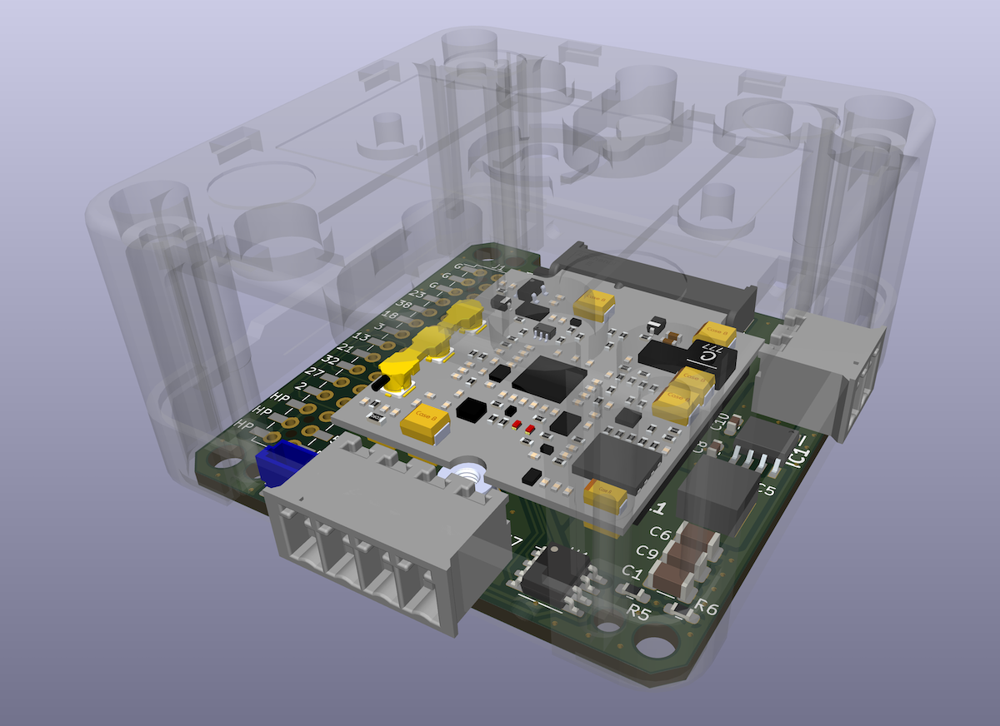
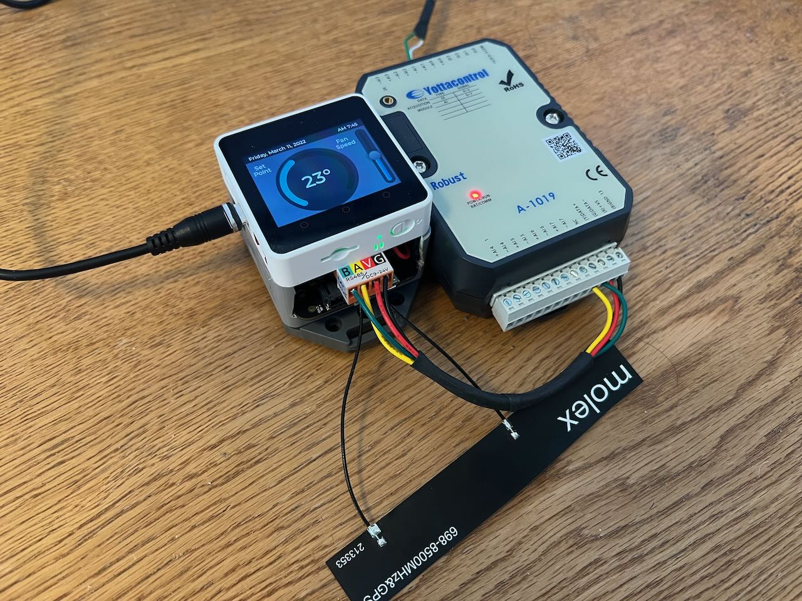
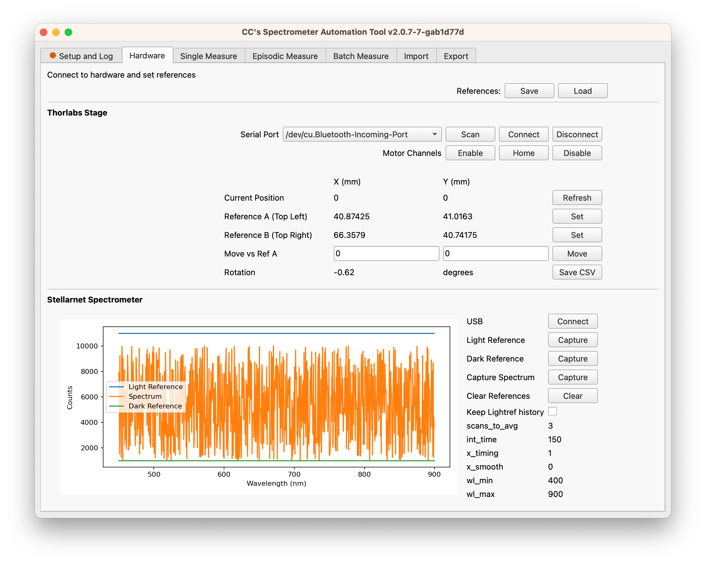
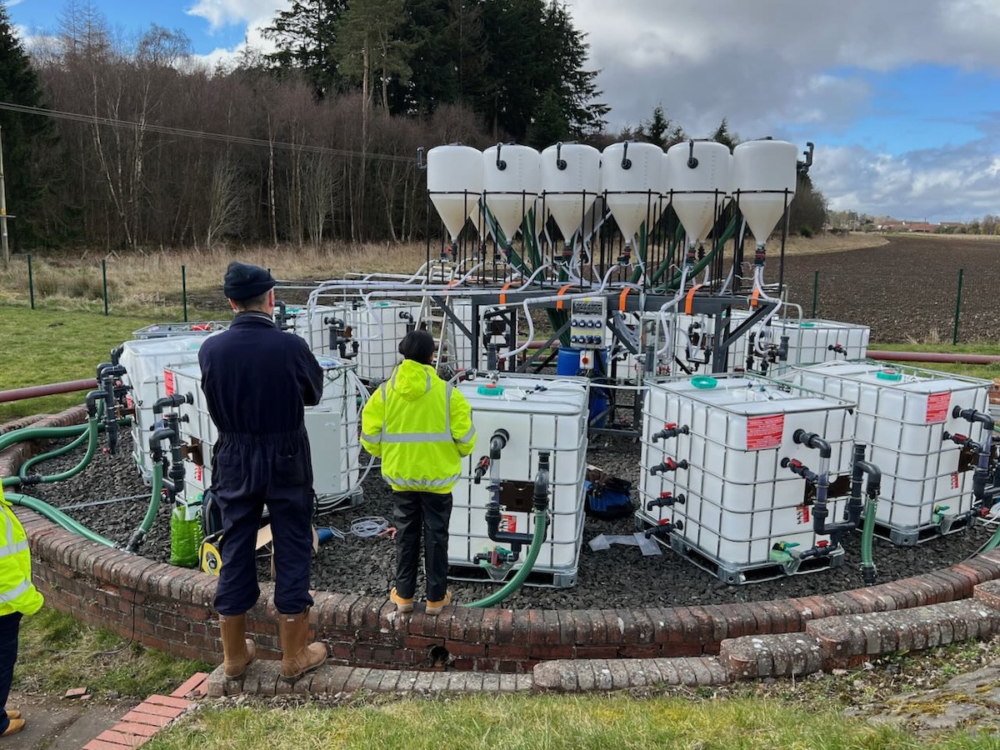
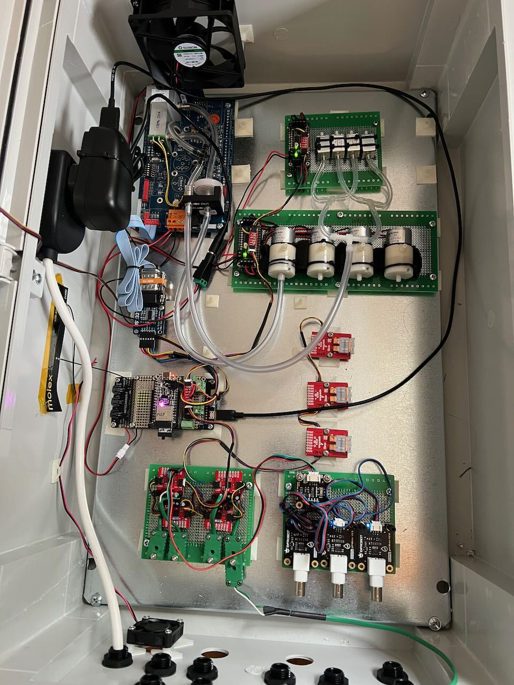
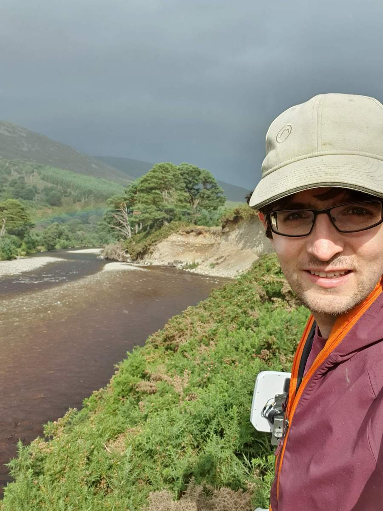
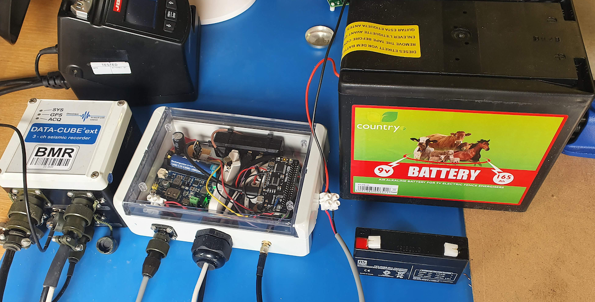
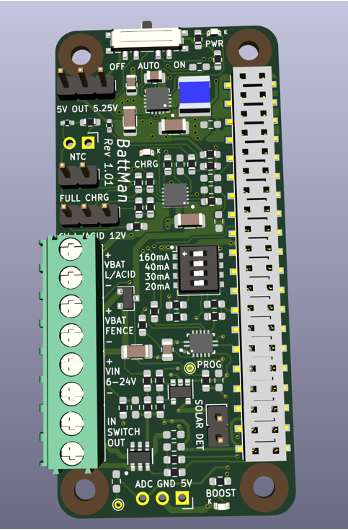
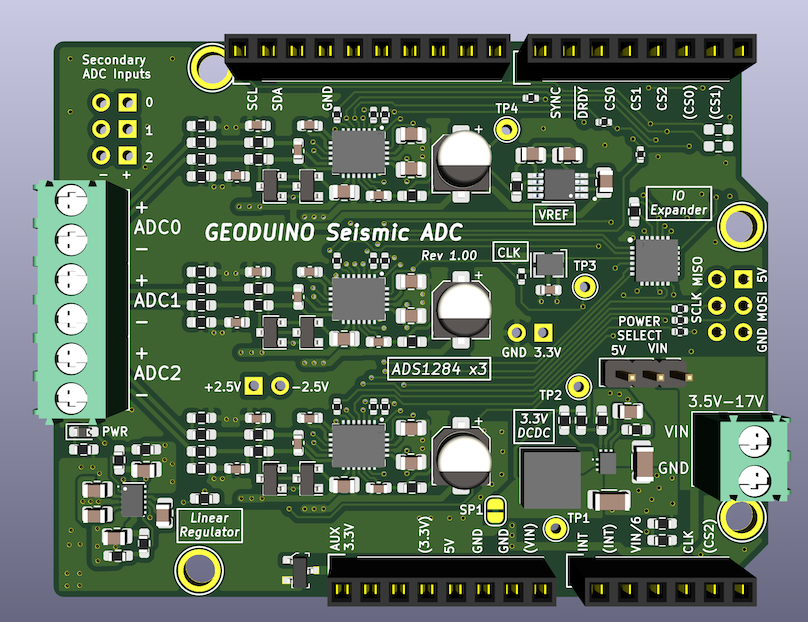

## Projects

A few images to illustrate my recent work

### IoT Heat Pump Controller

   
  PCB to interface Notecard with M5 Stack

   
  Early prototype of Notecard with M5 stack

### Lab Automation

   
  GUI for spectrophotometer data capture and processing

### Septic Tank Experiment

   
  Commissioning the system

   
  Sensor control box using Notecard and Circuitpython 
  includes gas pumps and valves, methane sensor, pH and temperature probe interfaces

### River Monitoring with Seismic sensors

   
  Testing LTE connectivity in the mountains with a directional antenna (spot the rainbow)

   
  Leveraging unconventional battery technologies

   
  Custom Power Management Board "BattMan"

   
  Custom Seismic ADC board

<!--
**calcut/calcut** is a ✨ _special_ ✨ repository because its `README.md` (this file) appears on your GitHub profile.

Here are some ideas to get you started:

- 🔭 I’m currently working on ...
- 🌱 I’m currently learning ...
- 👯 I’m looking to collaborate on ...
- 🤔 I’m looking for help with ...
- 💬 Ask me about ...
- 📫 How to reach me: ...
- 😄 Pronouns: ...
- ⚡ Fun fact: ...
-->
